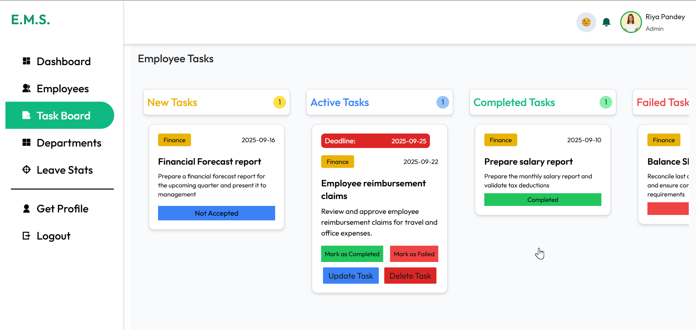

<div align="center">

#  E.M.S. -  Employee Management System

An Employee Management System built with the MERN stack (MongoDB, Express, React, Node.js).
This application provides role-based dashboards for Admins and Employees with powerful features like task management, leave requests, real-time updates, and department management.


</div>

---

# ✨ Features

🔐 **Authentication & Role-Based Access**

- Secure login & registration using JWT and bcrypt.

- Role-based access control for Admins and Employees.

🛠 **Admin Dashboard**

- Employee Management: Add, update, delete employee records.

- Task Management: Assign, update, delete tasks; mark tasks as completed/failed.

- Leave Approval: Review and approve/reject employee leave requests.

👩‍💻 **Employee Dashboard**

- Task Management: View assigned tasks, accept tasks, and mark them as completed/failed.

- Leave Requests: Submit leave applications and track request status.

🏢 **Department Management**

- Admins can add/remove departments to organize employees & tasks efficiently.

🎨 **Dark & Light Mode**

- Toggle between dark and light modes for a personalized interface.

🖼 **Image Upload (Multer + Cloudinary)**

- Profile image upload via Multer (backend file handling).

- Images stored and served from Cloudinary.

⚡ **Real-Time Updates**

- Both Admins and Employees get live updates on task progress and leave approvals.

# ⚙️ Installation & Setup

## 🔧 Prerequisites
- Node.js (v18+ recommended)
- npm (comes with Node.js)
- MongoDB (local or Atlas)

## 1. Clone the Repository
```bash 
git clone https://github.com/Nanditabisaria13/EMS.git
cd EMS
```

## 2. Backend Setup
```bash
cd EMS-backend
npm install

# Create a .env file in the EMS-backend folder with:

PORT=4000
MONGO_URI=your_mongo_db_connection_string
JWT_SECRET=your_jwt_secret
CLOUDINARY_NAME=your_cloudinary_name
CLOUDINARY_API_KEY=your_cloudinary_api_key
CLOUDINARY_API_SECRET=your_cloudinary_api_secret
```
## 3. Frontend Setup (Vite + React)
```bash
cd EMS-frontend
npm install

# Create a .env file inside EMS-frontend folder with:
VITE_BACKEND_URL= http://localhost:3000
```
## Run the Application
```bash
# Run backend
npm run server

# Run frontend
npm run dev

```
# Access the Application

- Frontend: `http://localhost:5173`
- Backend: `http://localhost:4000`

# Project Structure
```bash
EMS/
│── EMS-backend/       # Express.js API      
│   ├── config/        # Configuration files (DB, Cloudinary, etc.)
│   ├── models/        # MongoDB models
│   ├── routes/        # API routes
│   ├── controllers/   # Api Controller 
│   └── middleware/    # Auth & RBAC
│
│── EMS-frontend/          # React.js (Vite)
│   └── src/
│       ├── assets/    # Images, icons, and static files
│       ├── components/ # Reusable UI components
│       ├── context/   # Global state management (e.g., AdminContext, EmployeeContext)
│       └── pages/     # Page components (Admin, Employee, Common, etc.)
│
│
│── screenshots/     # Project screenshots (used in README)
│
└── README.md

```
# 📸 Screenshots  

### Home Page in Dark And Light Mode
<p align="center">
  
  
</p>  

###  Authentication Pages

<p align="center">
  
  
</p>  

### Admin Dashboard in Light and Dark Mode
<p align="center">
  
  
</p>  

### Admin Employees Section
<p align="center">
  
  
  
</p>  

### Admin Task Board Section
<p align="center">
  
  
</p>  

### Admin Department and Leave Stats Section
<p align="center">
  
  
</p>  

###  Employee Dashboard  in Dark and Light Mode
<p align="center">
  
  
</p>  

### Employee Task Board and Leave Stats Section
<p align="center">
  
  
  
</p>  

### Admin and Employee Profile 
<p align="center">
  
  
</p>  

# 💻 Tech Stack

- **Frontend** : React.js, TailwindCSS
- **Backend**: Node.js, Express.js
- **Database**: MongoDB (NoSQL)
- **Authentication**: JWT (JSON Web Tokens), bcrypt
- **File Uploads**: Multer + Cloudinary
- **Styling**: TailwindCSS (responsive + modern UI)

# 🤝 Contributing

Pull requests are welcome! Feel free to fork this repo and submit improvements.